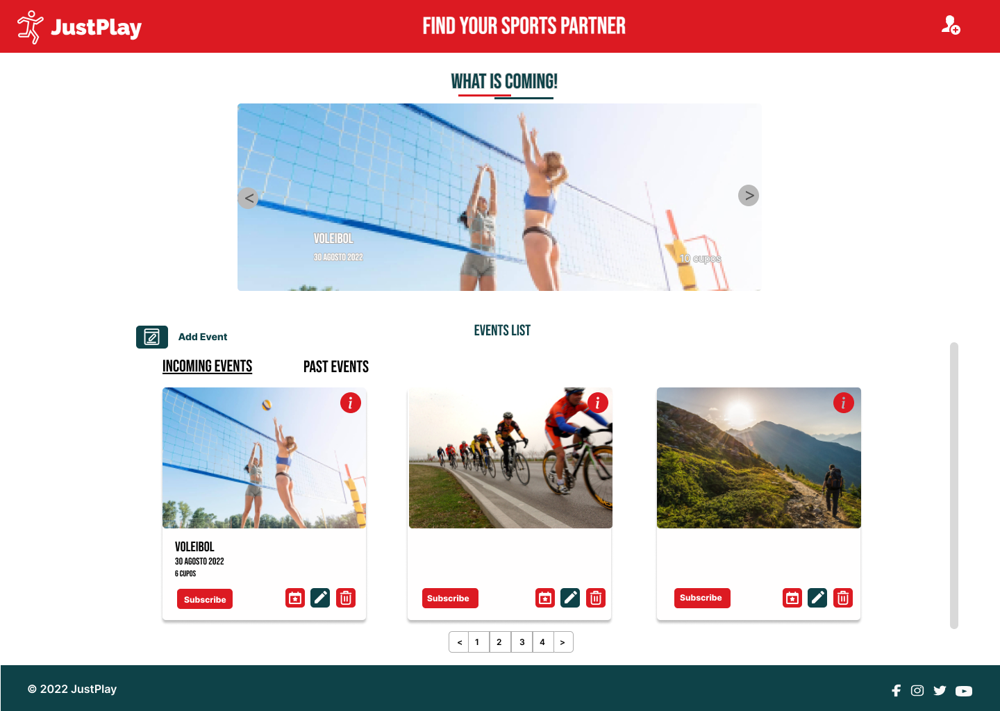
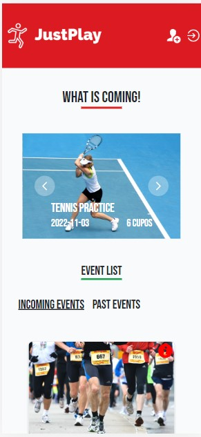

JustPlay

============

***

## Description

A software development group wants to create a web application to manage their online events such as workshops, masterclasses or webinars.

Users will be able to see the description of an event, sign up and unsubscribe. They will be able to see the list of the events they have signed up for. The administrator must have the tools for the management (CRUD) of the events.


## Functional Requirementes

<ul>
<li>On the cover, the application will have a slider with the featured masterclasses. these will be selectable by the administrator.</li>
<li>On the cover there will be a paginated list with all the events ordered from the closest to the furthest.</li>
<li>The events will include at least: title, date/time, maximum number of participants, description and an image.</li>
<li>Past events should be kept in the list but identifiable as unavailable.</li>
<li>Users must register to sign up for an event. Once signed up they will not be able to do it again.</li>
<li>Joining an event will receive an email (business - html ) with the link (zoom, meets, etc..) where it will take place, as well as remembering the title of the event, the time and the day.</li>
<li>Users will be able to see on one page the list of events to which they are registered.</li>
<li>The administrator will be able to CRUD the events.</li>
<li>When an event is full (maximum number of participants) no one will be able to register.</li>
</ul>


## Not Functional Requirements

<ul>
<li>The website must be 'deployed' even if it is under development.</li>
<li>All requirements and user cases must be tested (acceptance tests).</li>
<li>Laravel have to be used.</li>
<li>The sending of the email must be done using a queuing system.</li>
<li>For the frontend you should use blade components.</li>
</ul>


## Presentation:

<ul>
<li>GitHub link.</li>
<li>Readme with:</li>
    <ul>
        <li>Briefing and project explanation.</li>
        <li>Diagrams.</li>
        <li>Sketch - Mockup - Prototype.</li>
    </ul>
<li>Google Slides presentation.</li>
<li>Demo and code review</li>

</ul>

***
***

## Run Locally

Clone the project
```bash
  git clone https://github.com/Equipo-Proton/justplay-crud-laravel.git
```

Create a local database in phpMyAdmin with user: root, password: "".
Name of the database: justplay.
Execute migration: "php artisant migration:fresh --seed".

Go to the project directory
```bash
  cd justplay-crud-laravel
```

Install dependencies
```bash
  composer update
  npm install
```

Start the server
```bash
  run Apache and MySQL server in XAMPP
  php artisan serve
  npm run dev
```


## Technical requirements

- PHP 8.1.6
- Composer 2.3.10


## Run tests

To execute tests uncomment 2 lines of "phpunit.xml":
```php
    <server name="DB_CONNECTION" value="sqlite"/>
    <server name="DB_DATABASE" value=":memory:"/>
```
        
- vendor/bin/phpunit 
- php artisan test
- OK (8 tests, 13 assertions)


## 🛠️ Prototype

<p align="center"> 


</p>


## Work methodology

- TDD
- Agile
- Scrum
- Pair programming


## Versions

- develop: branch with work in development.
- Main: branch with current work.
- v1.0: Implementation of the Read and Delete with phpunit tests.
- v2.0:  Implementation of the Read and Delete with phpunit tests.
- v3.0: Final implementation with CRUD and Authentication.


#### Tools and technologies used

| Front End | Back End | Diseño y organización | 
| :---: | :---: | :---: |
|       |     |     |


## Documentation

- [Dailys](https://docs.google.com/document/d/1liH84SXscXYY4BS_w1ZbWIWB2hXiuaR0V_ZfhH4nhOI/edit?usp=sharing)
- [Presentation PPTX](https://docs.google.com/presentation/d/1bZ7vdmS8ArI8FaSERe12CAavoOyvut5mb_DrAyleek4/edit?usp=sharing)
- [Prototype](https://www.figma.com/file/wF99gStSlo5mO8d03M1Tat/Just-Play?node-id=6%3A3)
- [UserFlow](https://www.figma.com/file/pXnQMlo6iVQSkPrgn6O4bJ/User-Flow-JustPlay?node-id=0%3A1)
- [Emails](https://docs.google.com/presentation/d/1TGCLnGaKJa7cGVeS_zNEj4AZEE8Ci6Nq49nlLXrR3l8/edit?usp=sharing)


## Authors

| Nombre | Roll |  |
| :--- | :---: | :---: |
| Kerim Ozkan| Web Developer | https://github.com/ozknkrm |
| Miguel Salvador | Web Developer| https://github.com/miguelsalvadorrguez85 |
| Susana Martínez | Web Developer | https://github.com/Susipro |
| Guillermo García | Product Owner | https://github.com/guillerdev97 |
| Lucy Alvarado | Scrum Master| https://github.com/lucyalvarado4692 |


## Acknowledgements

 - [Awesome Readme Templates](https://awesomeopensource.com/project/elangosundar/awesome-README-templates)
 - [Awesome README](https://github.com/matiassingers/awesome-readme)
 - [How to write a Good readme](https://bulldogjob.com/news/449-how-to-write-a-good-readme-for-your-github-project)


